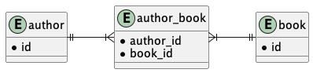
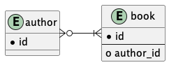

# 스프링 영속성 Best Practice

## 연관관계

### @OneToMany 연관관계를 효과적으로 구성하는 방법

- 부모측에서 자식 측 엔터티로만 상태가 전파되어야 함 (cascade)
- `mappedBy` 을 사용하여 양방향 연관관계 특성 부여
- `orphanRemoval` 을 사용하여 참조되지 않는 자식들의 삭제 보장
- 자식 측의 엔터티를 가져오지 않는 lazy 로딩 전략을  사용, 쿼리 기반에서만 즉시 가져오는 것이 좋음
- 혼동되지 않도록 `JoinColumn` 을 통해 의도된 컬럼명을 지정하는 것이 좋음
- 자식측에서 모든 엔터티 상태 전환에서 동일한 결과를 얻을 수 있도록 `equals`, `hashCode` 메서드 오버라이딩
- 메소드를 통한 연관관계 양쪽 상태 동기화
  - 동기화하지 않으면 엔터티 상태 전환으로 예상치 못한 동작 발생 가능

### 단방향 @OneToMany 연관관계를 피하는 이유

- `@ManyToOne` 누락되면 부모-자식 연관관계를 관리하기 위한 연결 테이블이 추가됨
  - ex) `author` - `author_books` - `book`
  - 3개의 조인 필요
  - 2개의 외래키 사용으로 불필요한 메모리 낭비

- 하나의 자식 데이터를 제거하거나 추가할 때, 연결 테이블에서 모든 데이터가 제거되고 자식 데이터들이 전부 다시 등록
  - 양방향에서는 해당 자식 데이터만 추가되거나 삭제됨
  - `@OrderColumn` 을 지정하면, 컬렉션 항목의 인덱스가 저장되어 연관관계가 정렬됨
    - 새 자식 데이터를 추가하거나, 마지막 데이터를 제거하는 경우 대상 데이터만 변경하여 약간의 이점
    - 첫 번째 자식 데이터를 삭제하면, 이후 모든 자식 데이터의 인덱스를 변경하는 `UPDATE` 쿼리가 추가 발생
  - `@JoinColumn` 을 지정하면 연결 테이블 없이 사용 가능
    - 자식 데이터를 추가 또는 제거하는 경우, 외래키 데이터를 변경하는 별도의 `UPDATE` 쿼리가 추가 발생

### 단방향 @ManyToOne 효율성

- 단방향 `@OneToMany` 와 다르게 정확히 일대다 2개의 테이블만 사용
- 더티 체킹 메커니즘은 예상대로 동작하고 불필요한 쿼리가 발생되지 않음

### @ManyToMany 연관관계를 효과적으로 구성하는 방법

- 오너와 `mappedBy`측을 선택해야 함
- 성능을 위해 `List` 대신 `Set` 사용
  - 삭제하는 경우, `List` 는 연결 테이블의 모든 항목을 제거하고 다시 등록
  - `Set` 은 해당 항목만 제거
- 메소드를 통한 연관관계 양쪽 상태 동기화
- 다른 엔터티에 의해 참조될 수 있으므로 `CascadeType.ALL` 및 `CascadeType.REMOVE` 사용하지 않기
  - 명시적으로 `CascadeType.PERSIST` 및 `CascadeType.MERGE` 사용
- `@JoinTable`을 사용하여 명시적으로 조인 테이블을 사용하는 것이 좋음
- 양측에 지연 로딩 사용 (`@ManyToMany` 의 기본 처리 방식)
- 동일한 엔터티 상태 전환 결과를 얻기 위해 양쯕 모두 `equals`, `hashCode` 메서드 오버라이딩
- `toString()` 기본 속성만 사용할 수 있도록 오버라이딩 주의
- `@OrderBy` 를 통해 순서 유지 가능

### CascadeType.REMOVE 및 orphanRemoval=true 사용해 하위 엔터티 제거를 피해야 하는 이유와 시기

- `orphanRemoval=true` 는 연결해제만 되어도 자동 삭제 (`false` 라면 업데이트)
- `CascadeType.REMOVE` 는 부모 엔터티를 삭제하면 연관된 자식 엔터티도 삭제
- 두 방식 모두 자식 엔터티가 영속성 콘텍스트에 없다면 먼저 로드를 수행 후 한 건씩 삭제됨
  - 자식 엔터티가 많다면 성능 저하
- 영속성 컨텍스트는 `deleteAllInBatch()` 를 통해 수행된 삭제를 인식하지 못함(다음 방식들로 해결 가능)
  - `deleteAllInBatch()` 를 재정의하여 `clearAutomatically` 를 `true` 로 설정하여 자동 클리어
  - 삭제 후 `flush()` 를 수행
  - 커스텀 메소드를 추가하여 `@Modifying(flushAutomatically = true, clearAutomatically = true)` 를 사용하여 수행 (선호)
- 모든 항목을 제거하는 가장 효율적인 방법은 `deleteAllInBatch()` 사용

### JPA 엔터티 그래프를 통해 연관관계를 가져오는 방법

- FetchType 2가지 속성
  - 페치 그래프(fetch graph)
    - `java.persistence.fetchgraph` 속성으로 지정되는 기본 가져오기 유형
    - `attributeNodes` 에 지정되는 속성들은 `EAGER` 로 처리, 나머지는 `LAZY`
  - 로드 그래프(load graph)
    - `java.persistence.loadgraph` 속성으로 지정되는 가져오기 유형
    - `attributeNodes` 에 지정되는 속성들은 `EAGER` 로 처리, 나머지 속성은 지정된 `FetchType` 또는 기본 값
- `@NamedEntityGraph` 로 엔터티 그래프를 정의

